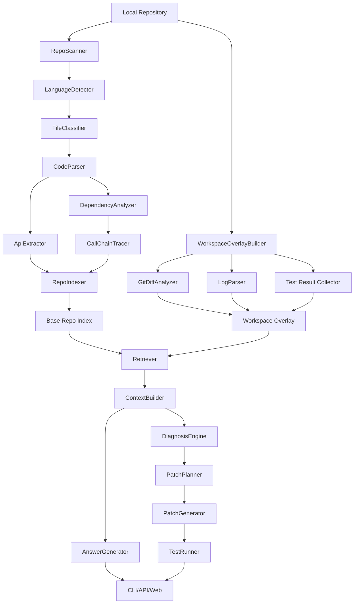
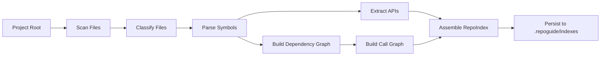
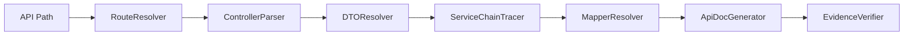
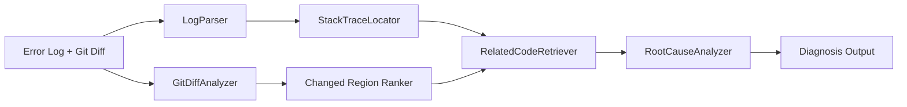
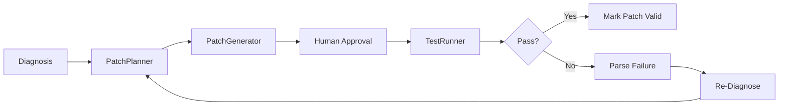
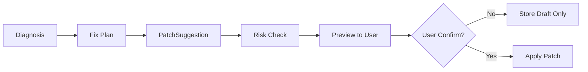

# RepoGuide 工程设计文档

以下设计文档严格围绕你给出的 **RepoGuide：面向项目交接的代码仓库理解与诊断 Agent** 的定位、设计原则与输出清单展开，默认遵循“**先 Core SDK 与 CLI，后 API，再到 Web**”“**本地工作区优先**”“**回答必须可溯源**”三条最高约束。fileciteturn0file0

## 01_project_overview.md

### 文档目的

定义 RepoGuide 的产品定位、要解决的问题、能力边界与 MVP 范围，确保项目从一开始就不是“代码 RAG 问答壳子”，而是一个**围绕项目交接、本地理解与错误诊断的工程化 Agent 系统**。

### 项目背景

在真实研发环境里，开发者接手陌生仓库时面临的问题并不是“搜不到某一段代码”，而是：

- 不知道项目如何启动，依赖哪些中间件，哪些配置是关键入口。
- 不知道代码结构与核心模块之间的边界。
- 不知道某个业务流程究竟从 Controller / Router 经历了哪些 Service、DAO、Redis、消息队列与外部接口。
- 本地改完代码后，错误常常并不来自当前文件本身，而来自调用链上游、配置差异、注入失败、SQL/实体不一致，或者最近 git diff 引入的连锁影响。
- 即使现有 AI 工具能补全代码或回答问题，也往往**缺少仓库级的结构化理解、对本地工作区未提交状态的感知，以及对答案证据的追溯**。

RepoGuide 的目标，是把一个陌生仓库转换成一个可交互、可追踪、可诊断、可扩展到修复与测试闭环的本地工程理解系统。

### 项目要解决的问题

RepoGuide 重点解决以下四类高频问题：

| 问题类别 | 典型问题 | 现有工具常见不足 | RepoGuide 目标 |
|---|---|---|---|
| 项目交接 | 这个项目怎么启动、模块怎么划分 | 只能全文搜索，无法生成结构化理解 | 自动生成项目地图、启动说明、阅读路径 |
| 接口与流程理解 | `/user/login` 是干什么的；登录流程怎么走 | 回答常停留在单文件级别 | 提供 Controller/Service/Mapper/DB 的链路解释 |
| 本地问题排查 | 改代码后为什么启动失败、接口报错、测试挂了 | 看不到未提交修改与日志之间的关系 | 结合 Base Repo Index + Workspace Overlay 诊断 |
| 修复与验证 | 应该怎么修；能否给 patch；修完是否通过测试 | 缺少受控 patch 与验证闭环 | 生成修复建议、diff patch、测试建议和追踪记录 |

### 目标用户

RepoGuide 的核心用户不是泛化“所有开发者”，而是以下几类高价值场景用户：

- **新人 / 实习生 / 新接手成员**：需要快速理解项目、定位入口与关键模块。
- **项目交接双方**：需要自动生成高质量交接文档、上手路线和核心接口摘要。
- **日常开发者**：需要理解接口、定位业务流程、分析依赖与中间件。
- **本地排障开发者**：需要结合 git diff、错误日志、测试结果做根因分析。
- **技术负责人 / Reviewer**：需要快速判断某次本地修改的风险与影响范围。

### 核心使用场景

RepoGuide 优先支持六个核心场景：

1. 新人接手陌生项目。
2. 项目交接文档生成。
3. 接口理解与接口文档补足。
4. 业务功能调用链解释。
5. 本地修改后报错诊断。
6. Patch 建议与测试验证闭环。

### 项目边界

RepoGuide 的边界必须明确，否则极易演变成一个“大而无当的平台”：

**做什么：**

- 读取本地仓库与当前工作区状态。
- 构建仓库结构化索引。
- 解析 Java / Spring Boot 与 Python / FastAPI 项目。
- 识别 API、入口文件、配置、中间件依赖、调用链。
- 综合 Base Repo Index、Workspace Overlay、错误日志与测试结果进行诊断。
- 生成可溯源回答、修复建议、patch 与测试建议。

**暂不做：**

- 在线代码托管平台替代品。
- 大规模远程仓库管理平台。
- 全功能 IDE。
- 自动部署 / 自动运维 / 自动变更发布系统。
- 无人工确认的自动重构系统。
- 多人协同编辑平台。

### 不做什么

RepoGuide 必须避免以下偏航：

- 不把“聊天问答”本身当成产品核心。
- 不把“接一个向量库 + LLM”当成架构完成。
- 不默认把整个代码仓库上传到云端。
- 不默认自动改代码。
- 不提供没有证据的泛泛回答。
- 不以 Web 页面为第一优先级。

### RepoGuide 与普通 RAG / 代码搜索工具 / Cursor / Copilot 的区别

| 对比项 | 普通 RAG / 代码搜索 | Copilot / Cursor 类工具 | RepoGuide |
|---|---|---|---|
| 核心对象 | 文档片段或代码片段 | 当前编辑区、局部上下文 | **整个仓库 + 当前本地工作区** |
| 主要能力 | 搜索与问答 | 补全、改写、对话 | **项目理解、调用链、诊断、patch、测试闭环** |
| 是否理解 git diff | 通常弱 | 部分可读，但不是核心模型 | **是核心能力** |
| 是否理解错误日志 | 一般依赖用户粘贴 | 能解释，但不一定结合仓库结构 | **日志 + diff + 调用链联合诊断** |
| 是否可追溯 | 往往只给片段 | 不一定稳定引用路径/行号 | **文件路径、函数、行号、证据摘要可追溯** |
| 是否面向交接 | 不是主要目标 | 不是主要目标 | **是第一目标** |

### 项目最终能力图

RepoGuide 的最终能力可以抽象为一条递进链路：

**仓库扫描 → 结构化索引 → 项目地图 → 接口理解 → 调用链解释 → 本地增量感知 → 日志/测试诊断 → Patch 建议 → 测试闭环 → 服务化与可视化**

### MVP 版本定义

建议把 MVP 定义为 **v1 + v2 + v3 的组合能力**，而不是一次做全：

**MVP 最小闭环：**

- 能扫描本地项目。
- 能识别项目类型、入口、配置、依赖与模块。
- 能通过 CLI 输出项目地图。
- 能回答“怎么启动、有哪些模块、配置在哪里”。
- 能解释指定 API 的处理路径。
- 能解释指定功能的基础调用链。
- 所有回答必须带文件路径、函数名、行号范围或符号引用。

**MVP 不包含：**

- 自动 patch。
- Web UI。
- 复杂多 Agent 编排。
- 多仓库统一管理。

### 项目亮点总结

RepoGuide 最大的亮点不是“会问答”，而是以下五点：

1. **Base Repo Index + Workspace Overlay 双层上下文模型。**
2. **结构化索引优先，而不是把整个仓库直接扔给 LLM。**
3. **本地工作区与 git diff 是一等公民，不是附加功能。**
4. **所有回答、调用链和诊断尽量可溯源、可核验。**
5. **后续可扩展到 patch 与测试闭环，但默认保持人类确认。**

---

## 02_user_scenarios.md

### 文档目的

通过真实开发场景定义系统行为，确保设计始终围绕“接手项目、理解项目、排查本地问题”而不是围绕单纯的 AI 能力堆砌。

### 场景一：新人接手陌生项目

#### 用户问题示例

- 这个项目怎么启动？
- 有哪些核心模块？
- 配置文件在哪里？
- 依赖 MySQL、Redis、MQ 吗？
- 我应该先看哪些文件？

#### 系统分析路径

系统需要优先分析以下信息源：

| 信息源 | 作用 |
|---|---|
| README / docs | 提取显式启动步骤、环境准备、模块说明 |
| `pom.xml` / `pyproject.toml` / `requirements.txt` | 确认语言、框架、依赖与构建工具 |
| `application.yml` / `.env.example` / `docker-compose.yml` | 确认数据库、缓存、消息队列与端口 |
| 项目入口文件 | 确认主应用启动点 |
| Controller / Router | 确认业务入口和接口类型 |
| Service / Mapper / Repository | 确认核心业务层与数据访问层 |
| migration / SQL schema | 确认数据库表与初始化方式 |

#### 期望输出

系统输出应包括：

- 项目简介。
- 技术栈。
- 启动前依赖准备。
- 启动命令与环境变量要求。
- 核心模块列表。
- 推荐阅读路径。
- 关键配置文件路径。
- 关键中间件依赖与连接信息位置。

#### 验收标准

用户无需手动翻遍仓库，就能在 3 到 5 分钟内知道：

- 怎么启动。
- 需要准备哪些依赖。
- 哪些模块最重要。
- 哪些文件必须先读。

### 场景二：项目交接文档生成

#### 用户问题

- 帮我生成这个项目的交接文档。
- 帮我生成新人上手路线。
- 帮我总结核心模块和接口。

#### 输出结构建议

生成的交接文档应当包括：

1. 项目概览。
2. 技术栈与运行依赖。
3. 启动方式与本地开发环境要求。
4. 模块划分。
5. 核心接口列表。
6. 数据库表或数据域概览。
7. 中间件依赖。
8. 常见问题。
9. 推荐阅读路径。

#### 系统行为要求

RepoGuide 不应只罗列文件，而应将结构化索引转为面向人的文档表达，例如：

- “先看入口，再看路由层，再看用户鉴权链路，再看订单领域模块。”
- “数据库主要使用 MySQL，Redis 用于会话/缓存，MQ 仅用于异步事件通知。”

### 场景三：接口理解

#### 用户问题

- `/user/login` 这个接口是干什么的？
- 需要哪些参数？
- 返回值是什么？
- 会调用哪些 Service？
- 会查哪些表？
- 什么情况下会返回 401 / 404 / 500？

#### 系统需要做的事

| 能力 | 说明 |
|---|---|
| Controller / Router 解析 | 找到路径与方法映射 |
| DTO / RequestBody 解析 | 推断请求字段、必填项、校验规则 |
| Response VO 解析 | 推断响应结构 |
| Service 调用链追踪 | 找到业务逻辑主流程 |
| Mapper / SQL 关联 | 找到表、SQL、查询语句 |
| 鉴权逻辑判断 | 判断是否有拦截器、中间件、权限注解 |

#### 输出要求

针对单个接口的解释必须至少包括：

- 接口路径与 HTTP 方法。
- 控制器处理方法。
- 请求参数与请求体。
- 响应结构。
- 鉴权与前置校验。
- 主要下游调用。
- 涉及数据库表、缓存与外部服务。
- 异常分支与常见失败原因。
- 证据来源。

### 场景四：功能调用链解释

#### 用户问题

- 登录流程是怎么走的？
- 每日打卡功能怎么实现的？
- 订单提交从接口到数据库经过哪些步骤？
- 为什么问答列表要批量查用户？

#### 输出目标

系统需要产出**一个业务流程叙事 + 调用链证据图**，包括：

- 入口点是什么。
- 经过哪些 Controller / Service / Mapper / DB / Redis / 外部 API。
- 每一步做了什么。
- 关键条件分支是什么。
- 可能的异常分支是什么。
- 哪些链路存在缺失链接，需要人工补充。

### 场景五：本地修改后报错诊断

#### 用户输入

- 错误日志。
- 测试失败日志。
- 运行命令输出。
- 或直接执行 `repoguide diagnose-diff --log error.log`。

#### 系统需要读取

- `git status`
- `git diff HEAD`
- staged diff
- 未提交文件、新增文件、删除文件
- 错误日志
- 测试结果
- Base Repo Index

#### 系统输出

- 错误类型与简要解释。
- 日志中最关键的堆栈位置。
- 与最近修改最相关的文件与行。
- 是否存在配置/依赖/注入/SQL/导入错误。
- 根因假设 Top-N。
- 修复建议。
- 是否建议生成 patch。

### 场景六：Patch 建议和测试验证

#### 设计原则

RepoGuide 不应一开始就自动改文件，而是：

1. 先生成修复建议。
2. 再生成 patch 草案。
3. 用户确认后 apply。
4. 执行测试命令。
5. 如果失败，则读取失败日志回流到 DiagnosisEngine。

#### 闭环输出

- Patch 内容。
- 修改原因。
- 风险等级。
- 推荐测试命令。
- 测试结果。
- 若失败，新的诊断结论。

### 场景设计总结

这六个场景共同定义了 RepoGuide 的产品核心：**“理解项目”与“诊断本地真实状态”是主轴，问答只是其中一种交互方式。**

---

## 03_architecture.md

### 文档目的

定义 RepoGuide 的总体架构、核心模块、分层职责、数据流与设计取舍，确保系统先成为可复用的本地工程能力，再扩展为服务与可视化产品。

### 分层架构

RepoGuide 建议采用以下五层到六层架构：

| 层级 | 角色 | 责任 |
|---|---|---|
| RepoGuide Core SDK | 核心能力层 | 扫描、解析、索引、检索、诊断、patch、测试、trace |
| RepoGuide CLI | 本地交互层 | 命令行入口，适配本地开发者工作流 |
| RepoGuide Agent Orchestrator | 任务编排层 | 面向复杂问题选择工作流、拼装上下文、做证据校验 |
| RepoGuide Local Runtime | 本地执行层 | 读文件、读 git、跑测试、解析日志、调用系统命令 |
| RepoGuide API Server | 服务包装层 | 将 Core SDK 能力以 API 暴露，便于后续 Web / 集成 |
| RepoGuide Web UI | 展示层 | 项目总览、调用链展示、patch 预览、trace 可视化 |

### 总体架构图



### 核心模块设计

| 模块 | 职责 | 是否 MVP 核心 |
|---|---|---|
| RepoScanner | 扫描仓库、收集文件元信息 | 是 |
| LanguageDetector | 判定语言与项目类型 | 是 |
| FileClassifier | 识别文件角色 | 是 |
| CodeParser | 抽取类、函数、注解、import、调用 | 是 |
| ApiExtractor | 抽取接口定义、路径、请求体、响应体 | 是 |
| DependencyAnalyzer | 构建依赖关系图 | 是 |
| CallChainTracer | 生成调用链与近似链路 | 是 |
| RepoIndexer | 构建 Base Repo Index | 是 |
| WorkspaceOverlayBuilder | 构建本地增量上下文 | v4 开始核心 |
| GitDiffAnalyzer | 分析 diff 与疑点区域 | v4 |
| LogParser | 解析日志、堆栈与错误类型 | v4 |
| Retriever | 统一检索入口 | 是 |
| ContextBuilder | 组装可控上下文 | 是 |
| AnswerGenerator | 生成可溯源答案 | v5 |
| DiagnosisEngine | 诊断引擎 | v4-v5 |
| PatchPlanner | 制定修复方案 | v7 |
| PatchGenerator | 生成 diff patch | v7 |
| TestRunner | 执行测试并结构化结果 | v7 |
| TraceRecorder | 记录过程与证据 | 是 |

### 数据流设计

#### 项目索引流程



#### 项目问答流程


#### 接口解释流程



#### 调用链追踪流程


#### 本地 diff 诊断流程



#### Patch 建议与测试流程



### 设计取舍

#### 为什么先做 Core + CLI，而不是先做 Web

原因不是“前端不重要”，而是核心价值不在展示，而在**可复用的本地工程能力**：

1. **问题发生在本地工作区。**  
   真正的 bug、未提交修改、错误日志、测试失败都发生在开发者本地。

2. **Web 会提前引入错误抽象。**  
   如果一开始先做 Web，容易把产品做成一个“在线问答壳子”，忽视本地 diff、日志、测试、路径与权限问题。

3. **CLI 更贴近实际场景。**  
   开发者希望在终端中完成 `index / ask / diagnose / test / patch` 的闭环。

4. **Core 能力必须先稳定。**  
   解析器、索引器、检索器、诊断器这些能力以后既服务 CLI，也服务 API、Web、IDE 插件。

### 架构设计结论

RepoGuide 的架构应该坚持“**本地优先、索引优先、证据优先、编排后置**”。先把仓库理解、结构化索引和增量诊断做好，再让 LLM 与 Agent 发挥放大作用。

---

## 04_development_roadmap.md

### 文档目的

给出从原型到产品化的渐进式路线，避免一开始设计过大、过重、过分依赖复杂 Agent 框架。

### 分阶段路线总览

| 版本 | 目标 | 输入 | 输出 | 需要完成的模块 | 不做什么 | 验收标准 |
|---|---|---|---|---|---|---|
| v0 纯文本原型 | 验证 I/O 结构 | 本地仓库路径 | 文件清单、目录树、手工规则项目摘要 | 扫描器、基础分类 | 不接 LLM、不做 patch | 能稳定列出目录、入口、配置候选 |
| v1 Core SDK | 完成核心扫描与基础索引 | 本地项目路径 | RepoSnapshot、RepoIndex、Project Map | Scanner、LanguageDetector、FileClassifier、Indexer | 不做诊断、不做 Web | 可以输出项目地图与关键文件 |
| v2 CLI 工具 | 建立本地交互闭环 | 仓库路径、用户命令 | `map / ask / explain-api / explain-flow` | CLI、ProjectMapper、Retriever、ContextBuilder 初版 | 不做 diff 诊断 | 能通过 CLI 完成结构理解 |
| v3 代码结构解析 | 支持 Java/Python 主流框架 | Java / Python 项目 | API 索引、符号索引、调用图初版 | CodeParser、ApiExtractor、DependencyAnalyzer、CallChainTracer | 不做 patch | 能解释常见接口与基础调用链 |
| v4 本地工作区诊断 | 支持 diff 与日志联合诊断 | git diff、error log、test log | Diagnosis | WorkspaceOverlayBuilder、GitDiffAnalyzer、LogParser、DiagnosisEngine | 不自动改代码 | 能定位最近修改引起的常见错误 |
| v5 LLM 问答增强 | 提升回答质量与可解释性 | 用户问题 + 检索结果 | 可溯源回答 | AnswerGenerator、EvidenceVerifier、LLM client | 不做复杂 multi-agent | 回答必须包含证据引用 |
| v6 Agent 编排 | 处理复杂任务和多步诊断 | 复杂问题、上下文 | 多节点 trace、任务型输出 | Orchestrator、Task Router、Planning、Verification | 不做大规模平台化 | 多步任务成功率明显提升 |
| v7 Patch 和测试 | 形成修复验证闭环 | Diagnosis、代码上下文 | PatchSuggestion、测试结果 | PatchPlanner、PatchGenerator、TestRunner | 不默认自动 apply | 用户确认后可应用 patch 并回传测试结果 |
| v8 FastAPI 服务化 | 稳定提供 API | repo_id、session、请求体 | REST API | API layer、Auth、Session、Trace endpoints | 不做复杂业务前端 | API 与 CLI 结果一致 |
| v9 Web UI | 可视化项目理解与调试链路 | API 数据 | 项目页、接口页、trace 页 | Web 层 | 不把核心逻辑置于前端 | 页面仅消费 API，不侵入内核 |

### v0：纯文本原型

#### 目标

先验证“用户真正需要什么输出”，而不是先追求复杂解析。

#### 推荐能力

- 扫描目录。
- 过滤忽略目录。
- 识别 README、配置、入口文件。
- 输出目录树与项目摘要。
- 基于规则给出“启动候选命令”和“关键文件列表”。

#### 验收标准

- 对 3 到 5 个典型仓库能给出可读的项目概览。
- 输出结果格式稳定。
- 不依赖 LLM。

### v1：Core SDK

#### 目标

建立所有后续功能复用的内核。

#### 要完成的事

- 定义 RepoSnapshot / RepoFile / RepoIndex 等核心模型。
- 落地扫描、分类、持久化。
- 实现项目地图生成。

#### 验收标准

- 输入仓库路径，能生成结构化索引文件。
- 可在二次调用时复用索引而无需全量重扫。

### v2：CLI 工具

#### 目标

用最贴近开发者工作方式的形式交付能力。

#### 命令范围

- `repoguide init`
- `repoguide index .`
- `repoguide map`
- `repoguide ask "..."`
- `repoguide explain-api "/xxx"`
- `repoguide explain-flow "登录流程"`

#### 验收标准

- 命令能串起来形成最小工作流。
- 每个输出都有来源引用。

### v3：代码结构解析

#### 目标

让输出不再依赖简单规则，而具备真实“理解”仓库的能力。

#### 要完成的事

- 支持 Java / Spring Boot 注解解析。
- 支持 Python / FastAPI 路由解析。
- 支持 DTO / VO / Entity / Pydantic Model 抽取。
- 支持 Service / Mapper / SQL 关联。

#### 验收标准

- 对典型 Spring Boot / FastAPI 项目，接口识别准确率达到可用水平。
- 调用链至少能覆盖核心 happy path。

### v4：本地工作区诊断

#### 目标

把 RepoGuide 从“理解工具”进化为“开发诊断工具”。

#### 命令

- `repoguide diff`
- `repoguide diagnose --log error.log`
- `repoguide diagnose-diff --log error.log`

#### 核心能力

- Base Repo Index + Workspace Overlay。
- diff 分析与行级可疑区域提取。
- 日志解析与栈定位。
- 根因假设排序。

#### 验收标准

- 能在人工注入 bug 的样本中，给出可信的 Top-3 根因。
- 输出中能明确区分日志证据、diff 证据与推理建议。

### v5：LLM 问答增强

#### 目标

利用 LLM 组织自然语言解释，但不允许牺牲证据链。

#### 核心原则

- 规则和索引先召回证据。
- LLM 负责总结、解释、归纳和补全缺失叙述。
- 不能无依据回答。
- 回答必须附带文件路径、符号与行号。

### v6：Agent 编排

#### 目标

处理复杂任务，例如“先理解接口，再定位报错，再给 patch 建议”。

#### 设计要求

- 编排是增强层，而不是前置依赖。
- 只有在多步问题上，才启用复杂规划。
- 所有节点必须可 trace。

### v7：Patch 和测试

#### 目标

形成“诊断—建议—验证”的工程闭环。

#### 验收标准

- 能生成 patch 草案。
- 用户确认后应用。
- 测试执行受控、可回滚、可追踪。
- 测试失败可自动回流诊断。

### v8：FastAPI 服务化

#### 目标

为后续 Web 和集成使用提供服务能力。

#### 核心要求

- API 只是封装 Core SDK。
- 不能把业务逻辑写死在接口处理层。

### v9：Web UI

#### 目标

提升可视化体验与结果展示。

#### 结论

Web 不是产品成立的前提，而是**当内核稳定后，用于放大可见性和演示价值**。

---

## 05_core_sdk_design.md

### 文档目的

定义 SDK 目录结构、核心类、接口边界以及稳定接口与可替换实现的划分。

### 建议目录结构

```text
repoguide/
  core/
    scanner/
    parser/
    indexer/
    retriever/
    context/
    diagnosis/
    patch/
    testing/
    tracing/
  cli/
  api/
  storage/
  config/
  docs/
  tests/
```

### 目录职责说明

| 目录 | 职责 |
|---|---|
| `core/scanner/` | 扫描仓库、识别文件、建立 RepoSnapshot |
| `core/parser/` | 做 AST / Tree-sitter / 规则解析，抽取符号、API、依赖 |
| `core/indexer/` | 构建 RepoIndex，生成图与检索索引 |
| `core/retriever/` | 混合检索入口，支持关键词 / 路径 / 符号 / 图邻居 / 向量 |
| `core/context/` | 上下文预算、切片拼装、证据格式化 |
| `core/diagnosis/` | 日志解析、diff 分析、根因推理、诊断输出 |
| `core/patch/` | 修复计划、patch 生成、风险检查 |
| `core/testing/` | 测试执行、失败解析、结果结构化 |
| `core/tracing/` | TraceRun、步骤记录、工具调用和审计 |
| `cli/` | 命令定义、参数解析、终端输出 |
| `api/` | 后期服务化包装层 |
| `storage/` | SQLite/DuckDB/FAISS/文件系统等存储实现 |
| `config/` | 配置模型、项目配置、运行策略 |
| `docs/` | 设计文档、用户手册、输出模板 |
| `tests/` | 核心单元测试、集成测试、评测样本 |

### 核心类与接口签名

以下只给接口签名与职责说明，不给实现代码。

```text
class RepoGuide:
    init_project(root_path, config) -> RepoHandle
    index(root_path, ref=None, full=False) -> RepoIndex
    map(repo_id, refresh=False) -> ProjectMap
    ask(repo_id, question, session=None, overlay=None) -> AnswerResult
    explain_api(repo_id, api_path, method=None, overlay=None) -> ApiExplanation
    explain_flow(repo_id, feature_query, overlay=None) -> FlowExplanation
    build_overlay(repo_id, log_paths=None, test_paths=None) -> WorkspaceOverlay
    diff(repo_id, ref="HEAD") -> DiffAnalysis
    diagnose(repo_id, log_input=None, overlay=None) -> Diagnosis
    diagnose_diff(repo_id, log_input=None, ref="HEAD") -> Diagnosis
    suggest_fix(repo_id, diagnosis_id) -> PatchSuggestion
    apply_patch(repo_id, patch_id, confirm=False) -> ApplyPatchResult
    test(repo_id, command=None, profile=None) -> TestRunResult
    trace(run_id) -> TraceRun

class RepoScanner:
    scan(root_path, ignore_rules=None) -> RepoSnapshot

class RepoSnapshot:
    from_scan(scan_result) -> RepoSnapshot

class RepoFile:
    summarize() -> FileSummary

class RepoIndexer:
    build(snapshot, parse_options=None) -> RepoIndex
    update(index, changed_files) -> RepoIndex

class RepoIndex:
    lookup_file(path) -> RepoFile
    lookup_symbol(name, fuzzy=False) -> list[CodeSymbol]
    lookup_api(path, method=None) -> list[ApiEndpoint]

class RepoRetriever:
    retrieve(query, repo_index, overlay=None, strategy=None, top_k=20) -> list[CodeReference]

class CodeReference:
    format_evidence() -> EvidenceItem

class ContextBuilder:
    build(task_type, question, references, overlay=None, budget=None) -> LLMContext

class ProjectMapper:
    generate(repo_index, overlay=None) -> ProjectMap

class ApiExplainer:
    explain(api_path, method, repo_index, overlay=None) -> ApiExplanation

class FlowExplainer:
    explain(feature_query, repo_index, overlay=None) -> FlowExplanation

class WorkspaceOverlayBuilder:
    build(repo_id, root_path, log_paths=None, test_paths=None) -> WorkspaceOverlay

class GitDiffAnalyzer:
    analyze(root_path, ref="HEAD", include_staged=True, include_untracked=True) -> DiffAnalysis

class LogParser:
    parse(log_input, language_hint=None) -> ParsedLog

class DiagnosisEngine:
    diagnose(repo_index, overlay, parsed_log=None, diff_analysis=None) -> Diagnosis

class PatchPlanner:
    plan(diagnosis, constraints=None) -> FixPlan

class PatchGenerator:
    generate(repo_index, overlay, fix_plan) -> PatchSuggestion

class TestRunner:
    detect_test_commands(repo_index) -> list[TestCommand]
    run(root_path, command=None, timeout=None) -> TestRunResult

class TraceRecorder:
    start(command, user_input, repo_id=None) -> TraceRun
    record_step(run_id, step_name, inputs=None, outputs=None, metadata=None) -> None
    finalize(run_id, status, outputs=None, error=None) -> TraceRun
```

### 核心类职责与交互关系

| 类 / 接口 | 负责什么 | 输入 | 输出 | 与谁交互 | 稳定性 |
|---|---|---|---|---|---|
| RepoGuide | 顶层 Facade，统一对外服务 | 用户命令、repo_id、问题 | 各类结构化结果 | 全部核心模块 | **核心稳定接口** |
| RepoScanner | 文件扫描与快照 | root_path | RepoSnapshot | FileClassifier | **核心稳定接口** |
| RepoIndexer | 索引构建与更新 | RepoSnapshot | RepoIndex | Parser、Extractor、Storage | **核心稳定接口** |
| RepoRetriever | 混合检索 | query、RepoIndex、Overlay | CodeReference 列表 | ContextBuilder、Diagnosis | **核心稳定接口** |
| ContextBuilder | 上下文预算与拼装 | 任务类型、证据、overlay | LLMContext | AnswerGenerator、Diagnosis | **核心稳定接口** |
| WorkspaceOverlayBuilder | 本地增量上下文 | git/log/test 输入 | WorkspaceOverlay | GitDiffAnalyzer、LogParser | **核心稳定接口** |
| DiagnosisEngine | 根因分析 | RepoIndex、Overlay、ParsedLog | Diagnosis | Retriever、PatchPlanner | **核心稳定接口** |
| PatchPlanner / PatchGenerator | 修复建议与 patch | Diagnosis | PatchSuggestion | TestRunner | **可演进接口** |
| TestRunner | 受控执行测试 | command、repo_path | TestRunResult | DiagnosisEngine、TraceRecorder | **可演进接口** |
| TraceRecorder | 可观测性 | 运行步骤 | TraceRun | 全部模块 | **核心稳定接口** |

### 哪些属于可替换实现

以下更适合做成抽象接口 + 插件实现：

- Parser 后端：Tree-sitter / 规则解析 / 语言专用解析器。
- 向量索引：FAISS / Chroma / 不启用向量检索。
- LLM Provider：本地模型 / 云 API。
- Storage：SQLite / DuckDB / 混合文件格式。
- Test 执行器：pytest / mvn / npm。
- Git Reader：subprocess git / GitPython。

### 设计结论

Core SDK 的关键不是类数量，而是**对真实场景的抽象稳定性**。顶层 `RepoGuide` 应保持清晰，底层解析器、索引器和生成器允许替换，但数据模型要尽量长期稳定。

---

## 06_data_model_design.md

### 文档目的

定义系统统一的数据模型，让扫描、解析、检索、诊断、patch 与 trace 使用同一套可组合的数据结构。

### 核心模型总览

| 模型 | 为什么需要 | 主要使用流程 |
|---|---|---|
| RepoSnapshot | 表示一次扫描得到的仓库静态快照 | 扫描、初始索引 |
| RepoFile | 表示单文件的结构化元信息 | 分类、解析、检索 |
| CodeSymbol | 表示类、函数、方法、常量等符号 | 符号索引、调用关系 |
| ApiEndpoint | 表示接口定义 | 接口解释、API 列表 |
| CallChain | 表示从入口到下游的链路 | 流程解释、诊断 |
| RepoIndex | 表示仓库级结构化索引 | 所有核心流程 |
| WorkspaceOverlay | 表示本地增量上下文 | diff 诊断、patch、测试 |
| Diagnosis | 表示一次错误分析结果 | 诊断、patch |
| PatchSuggestion | 表示一次修复建议 | patch 生成与应用 |
| TraceRun | 表示一次完整执行轨迹 | 调试、回溯、评测 |

### RepoSnapshot

#### 建议字段

- `repo_id`
- `root_path`
- `project_name`
- `detected_languages`
- `framework_type`
- `files`
- `config_files`
- `entrypoints`
- `test_files`
- `created_at`

#### 作用

RepoSnapshot 是最早期的“事实层”。它不关心复杂推理，只回答：当前仓库有什么、入口可能在哪里、配置和测试在哪里。

### RepoFile

#### 建议字段

- `path`
- `language`
- `role`
- `size`
- `hash`
- `content_summary`
- `symbols`
- `imports`
- `exports`

#### 作用

RepoFile 是所有高层能力的载体。文件角色的准确性会直接影响检索和调用链质量。

#### 推荐 role 枚举

- `entrypoint`
- `controller`
- `router`
- `service`
- `repository`
- `mapper`
- `dto`
- `vo`
- `entity`
- `config`
- `test`
- `migration`
- `sql`
- `readme`
- `build_manifest`
- `infra`
- `unknown`

### CodeSymbol

#### 建议字段

- `name`
- `type`
- `file_path`
- `start_line`
- `end_line`
- `signature`
- `decorators_or_annotations`
- `docstring_or_comment`
- `parent_symbol`

#### 作用

CodeSymbol 让系统不必总在“整文件”粒度工作，而能在类、方法、函数和模型粒度理解代码。

### ApiEndpoint

#### 建议字段

- `method`
- `path`
- `controller_file`
- `handler_name`
- `request_params`
- `request_body`
- `response_type`
- `auth_required`
- `service_calls`
- `mapper_calls`
- `related_tables`

#### 作用

ApiEndpoint 是接口解释、接口列表页、交接文档与故障排查的重要枢纽。

### CallChain

#### 建议字段

- `chain_id`
- `entrypoint`
- `nodes`
- `edges`
- `confidence`
- `missing_links`

#### 作用

CallChain 不要求 100% 完整，但要求对“链路已知部分”和“链路缺失部分”做明确表达。

### RepoIndex

#### 建议字段

- `repo_id`
- `file_index`
- `symbol_index`
- `api_index`
- `dependency_graph`
- `call_graph`
- `vector_index`
- `metadata`

#### 作用

RepoIndex 是系统真正的“仓库知识底座”。所有问答、解释、诊断、patch 都建立在它之上。

### WorkspaceOverlay

#### 建议字段

- `repo_id`
- `git_status`
- `changed_files`
- `added_files`
- `deleted_files`
- `untracked_files`
- `diff_summary`
- `raw_diff`
- `error_logs`
- `test_results`
- `generated_at`

#### 作用

WorkspaceOverlay 让系统知道“当前本地真实状态发生了什么变化”，这是 RepoGuide 区别于普通仓库问答系统的关键。

### Diagnosis

#### 建议字段

- `diagnosis_id`
- `error_type`
- `error_location`
- `suspected_files`
- `suspected_changes`
- `root_cause_hypotheses`
- `evidence`
- `recommended_fix`
- `confidence`
- `next_actions`

#### 作用

Diagnosis 是从“发现问题”到“建议修复”的中间层，它应该结构化、可排序、可审查。

### PatchSuggestion

#### 建议字段

- `patch_id`
- `diagnosis_id`
- `target_files`
- `diff_text`
- `explanation`
- `risk_level`
- `test_command`
- `rollback_plan`

#### 作用

PatchSuggestion 使 patch 具备治理属性，不再是一段随意改动，而是一份带解释、测试建议和回滚方案的可审阅产物。

### TraceRun

#### 建议字段

- `run_id`
- `command`
- `user_input`
- `steps`
- `retrieved_context`
- `llm_calls`
- `outputs`
- `errors`
- `started_at`
- `ended_at`

#### 作用

TraceRun 是调试系统本身、做评测、做可视化与写简历的基础。

### 设计结论

这些模型共同形成了三层抽象：

1. **事实层**：RepoSnapshot、RepoFile、CodeSymbol、ApiEndpoint、RepoIndex  
2. **增量层**：WorkspaceOverlay  
3. **推理与动作层**：Diagnosis、PatchSuggestion、TraceRun  

这样才能保证 RepoGuide 不是简单对话系统，而是带结构与状态的工程系统。

---

## 07_cli_design.md

### 文档目的

设计 CLI 命令树、参数、输出格式与本地目录约定，让 RepoGuide 最先成为一个好用的本地工具。

### CLI 设计原则

- 命令语义应该贴近开发者操作。
- 默认输出适合人读。
- 支持 `--json` 以便脚本集成。
- 所有复杂结果有对应 `run_id` 或结果 ID 可追踪。
- 默认读本地 `.repoguide/` 配置和索引。

### 命令树

```bash
repoguide
├── init
├── index [path]
├── map
├── ask "<question>"
├── explain-api "<api_path>"
├── explain-flow "<feature_query>"
├── diff
├── diagnose --log error.log
├── diagnose-diff --log error.log
├── suggest-fix --diagnosis <id>
├── apply-patch <patch_id>
├── test
└── trace <run_id>
```

### 命令说明

| 命令 | 用途 | 输入参数 | 输出格式 | 常见失败情况 |
|---|---|---|---|---|
| `repoguide init` | 初始化配置目录 | `--path` 可选 | 初始化结果、配置说明 | 目录无写权限 |
| `repoguide index .` | 构建或更新索引 | 路径、`--full`、`--ref` | 索引摘要、项目类型、入口、模块 | 非仓库目录、解析失败 |
| `repoguide map` | 输出项目地图 | `--refresh` | 模块图、关键文件、启动说明 | 无索引 |
| `repoguide ask` | 项目问答 | 问题文本、`--json` | 可溯源回答 | 检索不到足够证据 |
| `repoguide explain-api` | 解释单个接口 | API path、method | 接口文档式说明 | 路径匹配不到或歧义 |
| `repoguide explain-flow` | 解释业务流程 | 功能描述 | 调用链+流程说明 | 无法定位入口点 |
| `repoguide diff` | 查看本地变化摘要 | `--ref` | 变更文件、影响模块、热点区域 | 非 git 仓库 |
| `repoguide diagnose --log` | 基于日志诊断 | 日志文件 | Diagnosis | 日志无法解析 |
| `repoguide diagnose-diff --log` | 日志 + diff 联合诊断 | 日志文件 | Diagnosis with overlay evidence | 无 diff、无日志 |
| `repoguide suggest-fix --diagnosis` | 生成修复建议 | diagnosis_id | PatchSuggestion | diagnosis 不存在 |
| `repoguide apply-patch` | 预览或应用 patch | patch_id、`--confirm` | 应用结果、变更摘要 | patch 冲突、未确认 |
| `repoguide test` | 执行测试 | `--command`、`--timeout` | 结构化测试结果 | 命令未白名单、超时 |
| `repoguide trace` | 查看某次执行链路 | run_id | Trace 详情 | run_id 不存在 |

### 示例交互

#### 初始化

```bash
repoguide init
```

输出应包括：

- `.repoguide/` 已创建
- 默认忽略规则
- 默认测试命令模板
- 下一步建议：`repoguide index .`

#### 项目索引

```bash
repoguide index .
```

输出应包括：

- 项目类型：`java-springboot` 或 `python-fastapi`
- 扫描文件数
- 识别到的入口文件
- 识别到的核心配置文件
- API 数量、符号数量、模块数量摘要

#### 问答

```bash
repoguide ask "这个项目怎么启动？"
```

输出应包括：

- 启动依赖
- 启动命令候选
- 环境变量和配置位置
- 文件证据引用

### 输出格式建议

默认输出使用 Rich 风格组织为：

- 摘要区
- 证据区
- 风险 / 缺失区
- 下一步建议区

同时支持：

```bash
repoguide ask "..." --json
```

返回结构化 JSON，便于未来 API 或脚本复用。

### `.repoguide/` 本地目录结构

```text
.repoguide/
  config.yml
  indexes/
  cache/
  overlays/
  traces/
  patches/
  logs/
```

### 目录职责

| 目录 | 内容 |
|---|---|
| `config.yml` | 项目级配置，如忽略规则、测试命令白名单、解析偏好 |
| `indexes/` | RepoIndex 持久化结果 |
| `cache/` | 中间缓存，如切片摘要、向量缓存 |
| `overlays/` | Workspace Overlay 历史记录 |
| `traces/` | 每次执行的 TraceRun |
| `patches/` | PatchSuggestion、patch 文件与应用记录 |
| `logs/` | RepoGuide 自身运行日志 |

### 哪些文件可以提交，哪些应加入 `.gitignore`

#### 默认建议加入 `.gitignore`

- `.repoguide/cache/`
- `.repoguide/indexes/`
- `.repoguide/overlays/`
- `.repoguide/traces/`
- `.repoguide/patches/`
- `.repoguide/logs/`

#### `config.yml` 的建议

- 如果 `config.yml` 只包含仓库通用规则、忽略模式、推荐测试命令，可以**允许提交**。
- 如果其中包含 LLM key、私有路径、个人偏好参数，则必须拆出为环境变量或本地覆盖文件，并加入 `.gitignore`。

### CLI 结论

CLI 是 RepoGuide 的第一交付界面。只要 CLI 体验足够顺畅，后续 API 和 Web 就只是在复用已经成熟的核心能力。

---

## 08_indexing_and_parsing_design.md

### 文档目的

定义索引和解析层如何理解仓库，尤其是 Java / Spring Boot 与 Python / FastAPI 的支持方案。

### 设计原则

- **先规则、再 AST、最后向量。**
- 优先用稳定、成本低、可解释的方法抽取结构。
- 向量检索只在“语义召回”阶段使用，不承担结构真相。

### Java / Spring Boot 解析设计

#### 需要识别的对象

- `@SpringBootApplication`
- `@RestController`
- `@Controller`
- `@RequestMapping`
- `@GetMapping`
- `@PostMapping`
- `@PutMapping`
- `@DeleteMapping`
- `@Service`
- `@Component`
- `@Repository`
- `@Mapper`
- `@Autowired`
- `@Resource`
- DTO / VO / Entity
- Mapper XML
- `application.yml` / `application.properties`
- `pom.xml`

#### 解析策略

| 解析对象 | 主要方法 | 说明 |
|---|---|---|
| 应用入口 | AST + 注解规则 | 找 `@SpringBootApplication` 和 `main` 方法 |
| Controller / API | AST + 注解规则 | 解析类级与方法级路由并合并路径 |
| 依赖注入 | AST | 解析构造器注入、字段注入、`@Resource` |
| Service / Repository / Mapper | AST + 命名约定 | 识别业务层与持久层 |
| DTO / VO / Entity | AST + 注解 + 类名模式 | 类名后缀 + `@Entity` / `@TableName` 等 |
| Mapper XML | XML 解析 | namespace、id、SQL、表名 |
| 配置 | YAML / Properties 解析 | DB、Redis、MQ、port、profiles |
| 构建文件 | XML 解析 | 多模块、依赖、插件、打包方式 |

#### 调用关系构建

Java 项目的调用关系建议分三层构建：

1. **显式调用边**：方法体中的直接方法调用。
2. **注入依赖边**：Controller → Service，Service → Mapper / Repository。
3. **框架推断边**：Controller handler → 参数 DTO → 返回 VO；Mapper 接口 → Mapper XML SQL 节点。

### Python / FastAPI 解析设计

#### 需要识别的对象

- FastAPI app
- APIRouter
- `@router.get`
- `@router.post`
- Pydantic Model
- dependency injection
- `requirements.txt`
- `pyproject.toml`
- pytest tests

#### 解析策略

| 解析对象 | 主要方法 | 说明 |
|---|---|---|
| FastAPI app | AST + 规则 | 找 `FastAPI()` 实例 |
| APIRouter | AST | 找 `APIRouter()` 与 `include_router()` |
| 路由 | AST + decorator 规则 | 解析 method、path、handler |
| Pydantic Model | AST | 提取字段、类型、默认值 |
| Depends 依赖 | AST | 识别注入链 |
| 构建文件 | 文本 / TOML 解析 | 判断项目依赖与命令 |
| pytest | 文件命名 + AST | 识别测试入口和断言文件 |

#### 调用关系构建

Python 的调用图相比 Java 更动态，因此建议采用：

- AST 显式函数调用 + import 依赖。
- FastAPI 路由到 handler 的确定映射。
- 对动态调用保守标注 `missing_links`。
- 对数据库 / ORM / 外部 API 通过库调用模式与变量命名增强识别。

### 通用文件解析

需要统一识别以下文件：

- `README`
- `Dockerfile`
- `docker-compose.yml`
- `.env.example`
- SQL schema
- migration files
- test files
- config files

#### 为什么这些文件重要

因为开发者接手项目时，真正最先看的并不是 Controller，而往往是：

- 如何启动。
- 依赖哪些环境。
- 是否需要 Docker、MySQL、Redis、MQ。
- 数据库表从哪来。
- 测试怎么跑。

### 如何判断文件角色

建议采用“**规则优先、内容补充、上下文增强**”三段式：

1. **路径规则**：例如 `controllers/`、`services/`、`mappers/`、`tests/`。
2. **文件内容规则**：注解、继承、装饰器、关键 import。
3. **仓库上下文规则**：被哪些文件引用、是否被 include_router、是否在 Spring 扫描路径中。

### 如何抽取符号

优先使用 AST / Tree-sitter 抽取：

- 类
- 函数
- 方法
- 构造器
- 变量定义
- 导入语句
- 注解 / 装饰器

对难以完整解析的文件，可退化为规则抽取，但必须标注 `confidence` 较低。

### 如何抽取 API

API 抽取不应只靠正则，而应组合：

- 注解 / 装饰器解析
- 类级与方法级路径合并
- handler 方法签名解析
- DTO / body model 关联
- auth 相关中间件/注解关联

### 如何构建调用关系

建议采用分层图结构：

- **Import Graph**：文件与模块依赖关系
- **Symbol Call Graph**：函数 / 方法之间的调用关系
- **Framework Edge**：由框架规则推断出的链路
- **Resource Edge**：到 DB、Redis、MQ、HTTP Client 的资源调用边

### 如何处理大文件

- 优先按符号切片，不按字符长度粗暴切。
- 对特别大的类或 mapper 文件，抽取摘要与热点区域。
- 保留大文件的：
  - 文件摘要
  - 关键符号索引
  - 行号映射
  - 变更热点窗口

### 如何处理忽略目录

默认忽略：

- `node_modules`
- `target`
- `dist`
- `.git`
- `venv`
- `__pycache__`
- `.idea`
- `.mypy_cache`
- `build`
- `out`

支持在 `config.yml` 自定义覆盖。

### 什么时候使用规则解析

适合：

- 文件角色判定
- README / Dockerfile / YAML / TOML / XML
- Spring 注解识别
- FastAPI 路由 decorator 初步识别
- 日志错误类型识别

### 什么时候使用 AST / Tree-sitter

适合：

- 类、方法、函数边界
- import、依赖注入、参数与返回类型
- 函数调用与类成员关系
- Pydantic / DTO 字段抽取

### 什么时候使用向量检索

只在以下情况作为补充：

- 功能流程的语义召回，例如“打卡流程”“邀请奖励流程”。
- README、文档、注释等弱结构文本语义检索。
- 作为精确检索失败后的补充召回。

### 设计结论

索引与解析层的成败，决定 RepoGuide 是“可解释的工程工具”，还是“黑盒聊天助手”。因此必须坚持：**结构信息来自解析，语义补充才来自向量。**

---

## 09_retrieval_and_context_design.md

### 文档目的

设计检索与上下文构建策略，确保问题类型不同、证据优先级不同、上下文预算受控，避免把整个仓库塞给 LLM。

### 检索不是只做向量搜索

RepoGuide 的检索应该是**混合检索**，而非单一向量搜索。建议统一采用多路召回 + 排序框架。

### 检索信号组成

| 检索信号 | 适用场景 | 说明 |
|---|---|---|
| 关键词检索 | 项目概览、文档、配置 | 快、解释性强 |
| 文件路径匹配 | 已知模块或目录 | 对工程问题非常有效 |
| 符号匹配 | 接口、函数、类名 | 高精度 |
| API 路径匹配 | `explain-api` | 必须优先 |
| 调用图邻居扩展 | 功能流程、诊断 | 还原上下游关系 |
| git diff 文件提升权重 | 本地诊断 | 最近修改是高价值信号 |
| error log 文件与行号强制召回 | 报错排查 | 强制优先级最高 |
| 语义向量检索 | 模糊功能描述 | 作为补充召回 |

### 问题类型与检索策略

| 问题类型 | 主要召回 | 辅助召回 | 排序重点 |
|---|---|---|---|
| 项目总览 | README、入口、配置、manifest | 顶层模块目录 | 入口与配置优先 |
| 启动方式 | README、Docker、env、manifest、main | tests、scripts | 配置完整度优先 |
| 接口解释 | API 路径、handler、DTO、VO、service | auth、mapper、SQL | 精确路径匹配优先 |
| 功能流程 | feature 关键词、路由、service、call graph 邻居 | README、注释、测试 | 调用图连通性优先 |
| 报错诊断 | stack trace 文件/行、diff、相关调用链 | config、依赖文件 | 日志证据和 diff 优先 |
| 本地 diff 诊断 | changed files、hunks、受影响符号 | tests、config、import graph | 改动相关性优先 |
| Patch 生成 | diagnosis 涉及文件、邻近代码 | tests、风格示例 | 最小修改面优先 |
| 测试建议 | 测试文件、失败日志、相关模块 | build/test config | 最近失败相关优先 |

### 推荐排序思想

可以采用带权排序，但不必在早期实现太复杂。概念上可按以下优先级排序：

1. **精确匹配**
2. **错误日志定位**
3. **git diff 相关**
4. **调用图邻居**
5. **语义相似**
6. **摘要补充**

### ContextBuilder 的上下文预算策略

#### 核心原则

- 不能把整个项目塞给 LLM。
- 必须优先放入强证据。
- 必须携带来源信息。
- 大文件必须按符号或行块切片。
- 重复内容应去重。
- Overlay 与错误日志优先级高于普通背景。

#### 建议预算结构

可按“槽位”而不是纯 token 长度思考：

| 槽位 | 内容 | 优先级 |
|---|---|---|
| 固定槽位 | 任务说明、输出格式要求 | 高 |
| 证据槽位 A | 精确匹配文件 / handler / stack trace | 最高 |
| 证据槽位 B | diff 相关代码块、变更行附近上下文 | 最高 |
| 证据槽位 C | 调用图邻居与关键配置 | 高 |
| 背景槽位 | README、架构说明、模块摘要 | 中 |
| 兜底槽位 | 语义召回片段 | 中低 |

#### 切片策略

优先切片顺序：

1. 符号边界切片。
2. diff hunk 附近窗口切片。
3. stack trace 行附近窗口切片。
4. 大文件摘要。
5. 必要时才做固定行数切片。

### 上下文格式建议

每条证据建议结构化为：

- 文件路径
- 符号名
- 行号范围
- 证据类型（API / diff / log / config / test）
- 摘要
- 召回原因
- 置信度

这样 AnswerGenerator 和 DiagnosisEngine 都能复用同一套证据对象。

### 对本地 diff 和错误日志的优先策略

在诊断场景中，ContextBuilder 应强行插入：

- 错误摘要
- 栈顶文件与行号
- 最近修改文件列表
- 每个 changed hunk 附近代码
- 关联调用链摘要
- 相关配置文件片段

### 设计结论

检索和上下文构建是 RepoGuide 的中枢。如果这一步做得像“通用文本问答”，后续所有能力都会虚。必须坚持：**结构化精确召回为主，语义检索为辅；上下文预算服务于证据，而不是服务于模型。**

---

## 10_agent_workflow_design.md

### 文档目的

设计 Agent 工作流，但避免空泛地说“用 Agent”。每类任务都要拆成清晰节点，明确定义输入、输出、失败处理、Trace 记录点与人工确认点。

### 总体原则

- 能用规则做的优先用规则做。
- LLM 主要用于总结、归纳、补充叙述和 patch 草案生成。
- 每个节点都要能单独 trace。
- 高风险动作必须人工确认。

### 项目问答流程

#### 节点设计

| 节点 | 输入 | 输出 | 实现建议 | 失败时怎么办 |
|---|---|---|---|---|
| QuestionClassifier | 用户问题 | 问题类型 | 规则 + 小模型 | 回退为通用问答 |
| RetrievalPlanner | 问题类型、索引 | 检索策略 | 规则 | 使用默认混合检索 |
| CodeRetriever | 策略、RepoIndex、Overlay | CodeReferences | 检索引擎 | 若命中差，放宽策略 |
| ContextBuilder | 引用集、预算 | LLMContext | 规则 | 缩减背景槽位 |
| AnswerGenerator | 上下文 | 草案回答 | LLM | 若失败，输出结构化证据列表 |
| EvidenceVerifier | 草案、证据 | 校验后回答 | 规则 + LLM | 删去无依据结论 |
| FinalFormatter | 回答、引用 | CLI/API 输出 | 规则 | 输出简化格式 |

#### Trace 重点

- 问题分类结果
- 检索计划
- 召回文件与符号
- 被丢弃的证据
- 回答中的证据覆盖率

### 接口解释流程

#### 节点设计

| 节点 | 输入 | 输出 | 规则 / LLM |
|---|---|---|---|
| RouteResolver | API path + method | 精确 handler 候选 | 规则 |
| ControllerParser | handler | 控制器元信息 | 规则 |
| DTOResolver | 参数与 body 相关符号 | 请求结构 | 规则 |
| ServiceChainTracer | handler 下游调用 | 调用链草图 | 规则优先 |
| MapperResolver | service / mapper / SQL | 表与查询关系 | 规则优先 |
| ApiDocGenerator | 结构化信息 | 自然语言接口文档 | LLM |
| EvidenceVerifier | 文档草案 | 证据化接口说明 | 规则 |

#### 失败策略

- 若路径匹配不到，改用模糊路径匹配。
- 若调用链不完整，明确标注“以下链路为部分结果”。
- 若请求体模型推断不完整，输出字段来源与不确定性说明。

### 功能调用链流程

#### 节点设计

| 节点 | 输入 | 输出 | 规则 / LLM |
|---|---|---|---|
| FeatureIntentParser | 功能描述 | 关键词、候选模块 | 规则 + LLM |
| EntryPointFinder | 关键词、API 索引 | 入口点候选 | 规则 |
| CallGraphExpander | 入口点 | 调用图扩展结果 | 规则 |
| RelatedFileRetriever | 图节点 | 文件与配置证据 | 规则 |
| FlowSummarizer | 图与证据 | 流程解释 | LLM |
| MissingLinkReporter | 不完整图 | 缺口说明 | 规则 |

#### 失败策略

- 若找不到入口点，先返回“最相近的模块和接口”。
- 若图断裂，输出缺失点，不伪造链路。

### 报错诊断流程

#### 节点设计

| 节点 | 输入 | 输出 | 规则 / LLM |
|---|---|---|---|
| LogParser | error log | ParsedLog | 规则 |
| StackTraceLocator | ParsedLog | 关键文件、行号、用户代码栈 | 规则 |
| DiffAnalyzer | git diff | 可疑变更区域 | 规则 |
| RelatedCodeRetriever | 栈、diff、RepoIndex | 相关代码证据 | 规则 |
| RootCauseAnalyzer | 证据集 | 根因假设排序 | 规则 + LLM |
| FixAdvisor | 根因结果 | 修复建议 | LLM |
| ConfidenceEstimator | 证据覆盖度 | confidence | 规则 |

#### 失败策略

- 无日志时，退化为仅 diff 诊断。
- 无 diff 时，做日志 + Base Repo Index 诊断。
- 若 stack trace 全是框架代码，则回溯到最近用户代码帧与入口链路。

### Patch 建议流程

#### 节点设计

| 节点 | 输入 | 输出 | 人工确认 |
|---|---|---|---|
| DiagnosisLoader | diagnosis_id | Diagnosis | 否 |
| FixPlanGenerator | Diagnosis | FixPlan | 否 |
| PatchGenerator | FixPlan + Code Context | PatchSuggestion | 否 |
| PatchRiskChecker | PatchSuggestion | 风险分级 | 否 |
| TestPlanGenerator | PatchSuggestion | 建议测试方案 | 否 |
| HumanApprovalRequired | PatchSuggestion | apply / reject | **是** |

### 哪些节点需要人工确认

必须人工确认的步骤：

- apply patch
- 执行非白名单测试命令
- 覆盖配置文件
- 多文件高风险 patch
- 可能破坏环境的命令执行

### 哪些节点必须记录 Trace

几乎所有节点都建议记录，但最关键的是：

- 检索计划
- 证据集合
- 诊断假设排序
- patch 风险分级
- 测试结果
- 最终输出与失败原因

### 工作流设计结论

RepoGuide 的 Agent 不应追求炫技式自治，而应成为一种**可拆解、可 trace、可审计的工程流程编排器**。

---

## 11_workspace_overlay_design.md

### 文档目的

重点定义 Workspace Overlay，因为这是 RepoGuide 最关键、最有辨识度的能力之一。

### 为什么远程仓库不是唯一真实状态

在开发者日常工作中，真正引起问题的状态往往不在远程主干仓库，而在本地：

- 未提交修改。
- 新增文件。
- 删除文件。
- 临时配置改动。
- 尚未推送的 patch。
- 刚跑出的错误日志。
- 刚失败的测试结果。

如果系统只理解远程仓库，就无法回答“我刚改了什么，为什么现在挂了”。

### 为什么本地工作区才是用户遇到 bug 时的真实状态

开发者遇到的故障是**状态性**问题，而不是静态代码问题。  
例如：

- 一个新加的拦截器文件还没提交。
- 一个 import 指向了刚删除的工具类。
- 一个配置从 `application-dev.yml` 被临时改坏。
- 一个 SQL 参数对象字段改名，但 XML 还没同步。

这些都必须以 Workspace Overlay 表示，而不能硬塞进 Base Repo Index。

### Base Repo Index 和 Workspace Overlay 的关系

可以把二者理解为：

- **Base Repo Index**：稳定版本的结构化地图。
- **Workspace Overlay**：当前工作区的增量和运行期证据。

它们的关系不是替代，而是叠加：

```text
最终理解上下文 = Base Repo Index + Workspace Overlay + 当前用户问题
```

### Overlay 需要读取的内容

| 数据源 | 读取内容 | 用途 |
|---|---|---|
| `git status` | changed / staged / untracked / deleted | 变更范围感知 |
| `git diff HEAD` | 未提交改动 | 可疑修改定位 |
| staged diff | 暂存区变化 | 识别即将提交的变更 |
| untracked files | 新增文件 | 纳入候选证据 |
| deleted files | 删除文件 | 检查 import / 调用失效 |
| error logs | 栈、错误类型、位置 | 故障定位 |
| test results | 哪些测试失败、失败断言 | 验证链路和二次诊断 |

### Overlay 如何注入检索和诊断

#### 优先级规则

1. 最近修改文件优先。
2. 报错栈文件强制召回。
3. diff 修改行附近代码优先。
4. 新增文件必须纳入候选。
5. 删除文件应触发依赖缺失检查。
6. 如果最近修改涉及配置文件，则配置检查优先级上升。

#### 实现思路

Overlay 进入系统后，不只是“附加信息”，而应该改变排序与上下文构建：

- Retrieval 层对 changed files 增加 boost。
- Diagnosis 层对 diff hunk 周围符号增加怀疑权重。
- ContextBuilder 将日志摘要和变更摘要放在上下文顶部。
- PatchPlanner 优先建议最小修改面修复。

### 如何输出诊断证据

诊断结果中应明确区分证据来源：

| 证据类型 | 示例 |
|---|---|
| 日志证据 | “NPE 出现在 `LoginInterceptor.java:47`” |
| diff 证据 | “最近修改删除了 `userContext == null` 判空逻辑” |
| 项目索引证据 | “该拦截器由 WebMvcConfig 注册，作用于 `/api/**`” |
| 推理建议 | “高概率是登录态未写入 request attribute 导致” |

这样用户可以清楚知道：哪些是系统发现的事实，哪些是推理得出的建议。

### 示例流程：用户改了 LoginInterceptor，本地出现 NullPointerException

#### 已知条件

- 错误日志指向 `LoginInterceptor.preHandle()`。
- `git diff HEAD` 显示最近修改了 `LoginInterceptor`。
- Base Repo Index 知道该拦截器被配置在登录态鉴权链路上。
- 调用链显示 `LoginInterceptor` 会读取请求头 token 并调用 `UserContextService`。

#### RepoGuide 应如何工作

1. **LogParser** 识别 `NullPointerException`，抽取栈顶用户代码位置。
2. **StackTraceLocator** 定位到 `LoginInterceptor.java:47`。
3. **GitDiffAnalyzer** 找到这一行附近发生过修改，例如删除了 null 判断、改了注入字段、改了 token 解析逻辑。
4. **Retriever** 同时召回：
   - `LoginInterceptor`
   - `WebMvcConfig`
   - `UserContextService`
   - token 相关工具类
5. **DiagnosisEngine** 生成根因假设排序：
   - token 为空导致 userContext 为空；
   - 注入 bean 为空；
   - request attribute key 改名导致下游取值为空。
6. **Answer** 输出：
   - 日志证据；
   - diff 证据；
   - 调用链背景；
   - 修复建议；
   - 是否建议生成 patch。

### 设计结论

Workspace Overlay 不是二级功能，而是 RepoGuide 与普通“仓库问答工具”最本质的分界线。没有 Overlay，项目只能被“理解”；有了 Overlay，项目才能被“诊断”。

---

## 12_diagnosis_design.md

### 文档目的

定义错误诊断能力，覆盖 Java 与 Python 常见问题，并给出结构化诊断流程与输出格式。

### 支持的 Java 常见错误

| 错误类型 | 典型线索 | 首要检查 |
|---|---|---|
| NullPointerException | `NullPointerException` | 栈顶用户代码、最近改动、判空与注入 |
| BeanCreationException | Spring 启动失败 | Bean 定义、配置、依赖注入 |
| NoSuchBeanDefinitionException | 找不到 Bean | `@Service/@Component`、扫描路径、接口实现 |
| SQLSyntaxErrorException | SQL 语法错 | Mapper XML、字段名、表结构、参数绑定 |
| DataIntegrityViolationException | 约束冲突 | 唯一键、非空、外键、实体字段 |
| ClassNotFoundException | 类找不到 | 依赖、包路径、构建输出 |
| Port already in use | 端口冲突 | 配置端口、系统进程 |
| Redis connection failed | Redis 连接失败 | Redis 配置、环境、网络 |
| JWT 鉴权失败 | 401 / token invalid | token 生成/解析、密钥、拦截器 |
| 事务未生效 | 数据未回滚 | `@Transactional` 边界、自调用、异常捕获 |

### 支持的 Python 常见错误

| 错误类型 | 典型线索 | 首要检查 |
|---|---|---|
| ModuleNotFoundError | import 失败 | 环境、依赖、包路径 |
| ImportError | 导入失败 | 名称改动、循环导入 |
| AttributeError | 属性不存在 | 对象类型、字段变动 |
| TypeError | 参数类型或个数不对 | 函数签名、Pydantic 模型 |
| KeyError | 字典 key 缺失 | 输入数据结构变更 |
| Pydantic validation error | 模型校验失败 | 请求字段、类型、必填项 |
| FastAPI 422 | 请求体验证失败 | request body/schema |
| database connection error | DB 连接失败 | 配置、驱动、环境 |
| pytest failed assertion | 测试断言失败 | 最近业务改动、预期值改变 |

### 诊断流程

#### 诊断主流程

1. 错误类型识别。
2. 栈顶文件定位。
3. 区分用户代码与框架代码。
4. 最近修改相关性分析。
5. 调用链反查。
6. 配置检查。
7. 依赖检查。
8. 生成修复建议。

#### 规则解释

- **用户代码优先**：如果栈顶首先落在框架代码，要向上回溯到最近用户代码帧。
- **最近修改优先**：diff 中命中的文件和行应获得更高怀疑权重。
- **配置并列检查**：很多错误根因不在业务代码，而在 yaml / env / pom / requirements。
- **调用链反查**：定位当前错误点在业务流中的上下游，判断是否是上游数据不满足导致。

### 根因排序建议

DiagnosisEngine 建议至少输出 Top-3 根因假设，并为每条给出：

- 原因摘要
- 支持证据
- 反证或不确定点
- 建议检查步骤
- 修复方向

### 诊断输出格式

建议采用固定结构：

#### 错误摘要

- 错误类型
- 首次出现位置
- 影响范围
- 当前 confidence

#### 关键证据

- 日志证据
- diff 证据
- 调用链证据
- 配置证据

#### 可能原因排序

- 原因 1：最可能根因
- 原因 2：次优可能
- 原因 3：备选假设

#### 涉及文件

列出路径、函数、行号和角色。

#### 建议修复步骤

例如：

1. 先恢复空值保护逻辑。
2. 检查 bean 注入是否仍使用旧名称。
3. 验证 token 解析返回值是否可能为空。
4. 跑登录相关测试。

#### 建议运行的测试

- 单元测试命令
- 接口测试命令
- 集成测试命令

#### 是否可以生成 Patch

系统必须明确表态：

- 可以生成低风险 patch
- 可以生成 patch 草案，但建议人工确认
- 当前证据不足，不建议直接生成 patch

### 设计结论

诊断能力的好坏，不仅在于能否识别异常名，更在于能否把**日志、最近修改、调用链与配置**放在一起解释。RepoGuide 的诊断应当始终是一份**结构化的工程分析报告**，而不是一句“请检查空指针”。

---

## 13_patch_and_test_design.md

### 文档目的

定义 patch 与测试能力的边界、流程和安全控制，确保 RepoGuide 可以帮助修复，但不会越权自动破坏用户工作区。

### Patch 设计原则

1. Patch 不应默认自动应用。
2. 必须先生成 `PatchSuggestion`。
3. 用户确认后才能 apply。
4. 每个 patch 都必须带解释、风险等级与回滚方案。
5. patch 是“最小修改建议”，而不是大规模重构。

### PatchSuggestion 必需字段

- 修改文件
- diff
- 修改原因
- 风险等级
- 回滚方案
- 建议测试命令

### Patch 风险等级建议

| 风险等级 | 特征 |
|---|---|
| Low | 单文件、小范围、无公共接口变化 |
| Medium | 影响多个方法或配置，但范围可控 |
| High | 影响多文件、公共接口、数据结构 |
| Critical | 涉及敏感配置、大量删除、不可逆迁移 |

### Patch 生成流程



### apply-patch 的行为要求

- 默认先预览，不执行写入。
- 加 `--confirm` 才可应用。
- 应用前自动保存备份或记录 reverse patch。
- 应用后立即建议运行测试。
- Trace 记录 patch 来源、应用结果与文件变更摘要。

### TestRunner 设计要求

#### 支持命令

- `pytest`
- `mvn test`
- `npm test`

#### 必需能力

| 能力 | 说明 |
|---|---|
| 超时控制 | 防止测试卡死 |
| 输出截断 | 避免海量日志挤爆上下文 |
| 错误日志保存 | 便于二次诊断 |
| 测试结果结构化 | 便于回传 DiagnosisEngine |
| 失败后闭环 | 自动进入再次诊断流程 |

### 失败闭环

```text
Patch → Run Test → Fail → Parse Failure → Diagnose Again → Suggest New Patch
```

这条闭环是 RepoGuide 从“会解释”走向“帮助修复”的关键。

### 测试结果结构建议

- `status`
- `command`
- `duration_ms`
- `exit_code`
- `passed_count`
- `failed_count`
- `skipped_count`
- `failure_summaries`
- `raw_log_path`

### 安全边界

RepoGuide 必须明确禁止：

- 自动删除大量文件。
- 修改隐藏配置文件中的敏感信息。
- 无确认执行 destructive 命令。
- 执行下载脚本、删除脚本、系统级写操作。
- 在未授权情况下访问仓库外目录。

### 设计结论

Patch 和测试能力的价值，不在于“自动改代码”，而在于**把修复建议工程化、受控化、可验证化**。这也是 RepoGuide 与普通聊天修 bug 的根本区别。

---

## 14_storage_and_trace_design.md

### 文档目的

设计本地存储格式和 Trace 体系，为调试、审计、评测、Web 展示和简历包装奠定基础。

### `.repoguide/` 目录设计

在 CLI 文档基础上，这里进一步细化存储结构：

```text
.repoguide/
  config.yml
  indexes/
    repo_meta.json
    repo_index.db
    vector/
  cache/
    file_summaries/
    parsed_ast/
  overlays/
    latest_overlay.json
    history/
  traces/
    <run_id>/
      manifest.json
      steps.jsonl
      outputs.json
      llm_calls.jsonl
  patches/
    <patch_id>.diff
    <patch_id>.json
    applied/
  logs/
    app.log
    commands.log
```

### Index 存储格式

建议采用分层存储：

| 类型 | 建议格式 | 作用 |
|---|---|---|
| 元数据 | JSON | 项目概览、版本、索引时间 |
| 结构化索引 | SQLite 或 DuckDB | 文件、符号、API、图关系 |
| 向量索引 | FAISS / Chroma 可选 | 语义召回 |
| 大文件摘要 | JSON | 降低重复解析成本 |

#### 为什么推荐 SQLite 起步

- 本地部署简单。
- 查询灵活。
- 适合存文件、符号、API、图边等结构化表。
- 后期 Web 服务化也容易迁移。

DuckDB 更适合分析型查询，可作为后续增强，而非一开始必须引入。

### Overlay 存储格式

Overlay 建议用 JSON 存储，便于序列化和回放：

- `git_status`
- `changed_files`
- `hunks`
- `logs_summary`
- `test_summary`

同时保留原始日志路径引用，避免重复保存超大文本。

### TraceRun 存储格式

每次执行一个独立目录，建议包含：

| 文件 | 内容 |
|---|---|
| `manifest.json` | run_id、命令、时间、最终状态 |
| `steps.jsonl` | 每一步节点日志 |
| `outputs.json` | 最终结果 |
| `llm_calls.jsonl` | prompt 摘要、token、响应摘要 |
| `context_refs.json` 可选 | 本次用到的文件与行号引用 |

### Patch 存储格式

每个 patch 应至少包含两部分：

1. `.diff`：可读的补丁文本。
2. `.json`：结构化说明，包括原因、风险、测试建议、适用 diagnosis、应用状态。

### 日志存储格式

- `app.log`：程序运行日志。
- `commands.log`：命令级记录。
- `diagnosis.log` 可选：诊断摘要。
- 日志中应避免落盘敏感变量明文。

### Trace 每次需要记录什么

- 用户命令
- 用户输入
- 问题分类
- 检索到的文件
- 使用的上下文
- LLM 调用摘要
- 工具调用
- 输出结果
- 错误
- 耗时
- token 消耗
- 最终状态

### Trace 的价值

#### Debug

当输出错误时，可以定位是：

- 分类错了
- 检索错了
- 上下文预算不够
- 证据校验没拦住
- patch 风险控制不足

#### 简历展示

Trace 让项目从“一个模糊的 AI 工具”变成“一个有可观测性设计的工程系统”。

#### 后续 Web 可视化

Trace 天然适合展示：

- 任务流程图
- 检索证据链
- 诊断推理链
- patch 生成链

#### Agent 评测

Trace 能把失败样本收集起来，支持离线复盘和指标分析。

### 设计结论

Storage 和 Trace 不是附属工程细节，而是 RepoGuide 做“工程级产品”必须具备的基础设施。

---

## 15_api_server_design.md

### 文档目的

设计后期 FastAPI 服务化接口，但强调：**API 只是 Core SDK 的服务包装，不应污染内核设计。**

### 设计原则

1. API 不是第一阶段目标。
2. API 不负责核心逻辑，只调用 Core Service。
3. Web 页面只是 API 的消费者，不反向定义内核。
4. 涉及本地 patch / test 权限的接口必须更严格。

### REST API 设计

| 接口 | 请求参数 | 响应结构 | 错误码 | 调用 Core Service | 是否需本地权限 | 是否适合 Web |
|---|---|---|---|---|---|---|
| `POST /repos/index` | `root_path`、`ref`、`full` | `repo_id`、索引摘要 | 400/500 | `RepoGuide.index` | 是 | 适合本地 Web |
| `GET /repos/{repo_id}/map` | `refresh` | `ProjectMap` | 404/500 | `RepoGuide.map` | 否 | 是 |
| `POST /repos/{repo_id}/ask` | `question`、`session_id` | `AnswerResult` | 404/422/500 | `RepoGuide.ask` | 否 | 是 |
| `POST /repos/{repo_id}/explain-api` | `path`、`method` | `ApiExplanation` | 404/422 | `RepoGuide.explain_api` | 否 | 是 |
| `POST /repos/{repo_id}/explain-flow` | `feature_query` | `FlowExplanation` | 404/422 | `RepoGuide.explain_flow` | 否 | 是 |
| `POST /repos/{repo_id}/diagnose` | `log_text` 或 `log_path` | `Diagnosis` | 404/422/500 | `RepoGuide.diagnose` | 是 | 条件适合 |
| `POST /repos/{repo_id}/diagnose-diff` | `log_text/log_path`、`ref` | `Diagnosis` | 404/422/500 | `RepoGuide.diagnose_diff` | 是 | 条件适合 |
| `POST /repos/{repo_id}/suggest-fix` | `diagnosis_id` | `PatchSuggestion` | 404/422 | `RepoGuide.suggest_fix` | 否 | 是 |
| `POST /repos/{repo_id}/apply-patch` | `patch_id`、`confirm` | `ApplyPatchResult` | 403/404/409 | `RepoGuide.apply_patch` | **是** | 谨慎 |
| `POST /repos/{repo_id}/test` | `command`、`timeout` | `TestRunResult` | 403/422/500 | `RepoGuide.test` | **是** | 谨慎 |
| `GET /traces/{run_id}` | 无 | `TraceRun` | 404 | `RepoGuide.trace` | 否 | 是 |

### 建议的响应结构

建议统一返回：

- `success`
- `run_id`
- `data`
- `warnings`
- `errors`

这样 CLI、Web、第三方集成都能统一处理。

### 是否适合 Web 调用的判断

#### 适合 Web 的

- map
- ask
- explain-api
- explain-flow
- trace

#### 需要谨慎的

- index
- diagnose
- diagnose-diff
- apply-patch
- test

因为这些接口往往需要读取本地文件系统、执行命令或修改工作区。

### 本地 CLI 和 API Server 的关系

建议关系如下：

- **CLI**：直接调用 Core SDK，是第一交付形态。
- **API Server**：把同一组 Core SDK 能力包装成 HTTP 服务。
- **Web**：调用 API Server 展示结果。

也就是说：

```text
Core SDK 是源头
CLI / API 是两个薄包装
Web 是 API 的消费者
```

而不是：

```text
先写 Web，再把逻辑拆回后端
```

### 设计结论

API Server 的正确定位是“后期扩展的服务化壳层”，而不是产品的起点。

---

## 16_web_ui_later_design.md

### 文档目的

描述后期 Web 页面规划，但不展开前端代码实现，并强调 Web 应最后做。

### 页面设计总览

| 页面 | 展示什么 | 依赖哪些 API | 不负责什么 |
|---|---|---|---|
| 项目总览页 | 项目类型、模块、入口、依赖、启动说明 | `/map` | 不负责索引逻辑 |
| 模块地图页 | 模块树、关键目录、模块关系 | `/map` | 不负责解析 |
| 文件浏览页 | 文件摘要、符号、引用关系 | 后续 file/detail API | 不负责文件读取策略 |
| 接口列表页 | 路由列表、方法、处理器、鉴权 | `/explain-api`、API list | 不负责 API 抽取 |
| 对话问答页 | 问题、回答、证据引用 | `/ask` | 不负责检索与生成 |
| 报错诊断页 | 日志上传、Diagnosis 结果、证据链 | `/diagnose`、`/diagnose-diff` | 不负责根因分析 |
| Git diff 分析页 | changed files、hunk、关联影响 | `/diagnose-diff`、diff API | 不负责读取 git |
| Patch 展示页 | patch 预览、风险等级、测试建议 | `/suggest-fix`、`/apply-patch` | 不负责 patch 生成 |
| Trace 执行链路页 | 节点步骤、检索证据、LLM 摘要 | `/traces/{run_id}` | 不负责 trace 记录 |

### 每个页面应该展示什么

#### 项目总览页

- 项目名称、类型、语言、框架
- 主入口
- 启动方式
- 关键模块
- 关键依赖与环境变量位置

#### 模块地图页

- 目录树
- 模块关系图
- 每个模块的角色、关键文件、对外接口

#### 接口列表页

- API path + method
- controller / handler
- request / response 模型
- 鉴权与中间件

#### 报错诊断页

- 错误摘要
- Top-3 根因
- 证据分类展示
- 建议 patch
- 推荐测试命令

#### Patch 展示页

- diff 视图
- 风险等级
- 解释说明
- 应用按钮与确认框
- 回滚说明

#### Trace 执行链路页

- 执行时间线
- 每个节点输入/输出
- 检索文件列表
- 最终回答与校验结果

### 为什么 Web 应该最后做

1. 没有稳定 Core，Web 只能展示脆弱结果。
2. Web 早做会诱导团队优先做“看上去好看”的功能。
3. 本地工作区、test、patch 等能力，本质上先依赖 CLI 与本地 Runtime。
4. Web 的价值在于可视化、演示和协作，而不是定义产品内核。

### 设计结论

Web 是 RepoGuide 的放大器，不是 RepoGuide 的发动机。

---

## 17_evaluation_design.md

### 文档目的

设计可量化评测体系，让 RepoGuide 的效果能够被验证、迭代和展示。

### 核心指标

| 指标 | 定义 |
|---|---|
| Project Map Accuracy | 项目地图中关键模块、入口、依赖识别的正确率 |
| API Extraction Accuracy | 接口路径、方法、handler、request/response 抽取准确率 |
| Call Chain Accuracy | 调用链节点与边的准确率 |
| Retrieval Precision | 检索前 K 个证据中相关项比例 |
| Answer Citation Coverage | 回答中有证据支持的关键结论占比 |
| Diagnosis Top-1 Accuracy | 根因第一名命中率 |
| Diagnosis Top-3 Accuracy | 根因前三名包含正确答案的比例 |
| Patch Success Rate | 生成 patch 后通过目标验证的比例 |
| First-pass Patch Success Rate | 首次 patch 即通过的比例 |
| Test Pass Rate | 建议测试命令通过比例 |
| Average Token Cost | 单任务平均 token 消耗 |
| Average Runtime | 单任务平均运行耗时 |
| User Confirmation Rate | patch 被用户确认采纳的比例 |

### 指标计算建议

#### Project Map Accuracy

可按模块、入口、关键配置三类加权计算：

- 模块识别准确率
- 启动入口识别准确率
- 中间件依赖识别准确率

#### API Extraction Accuracy

建议拆成：

- 路径准确率
- 方法准确率
- handler 准确率
- request body 字段准确率
- response model 准确率

#### Call Chain Accuracy

建议按边级 F1 评测，而不是只看节点是否出现。

#### Answer Citation Coverage

统计回答中非平凡结论里，有明确文件/函数/行号支持的比例。

### 评测数据集设计

建议构建四类数据集：

1. **Java Spring Boot 示例项目**
2. **Python FastAPI 示例项目**
3. **人工注入 bug 样本**
4. **历史 bug / 错误日志 / 调用链问答样本**

### 样本字段设计

每个评测样本建议包含：

- `repo_id`
- `question` / `log` / `diff`
- `expected_files`
- `expected_symbols`
- `expected_answer_points`
- `expected_root_cause`
- `expected_patch`，可选
- `test_command`，可选

### 样本类型举例

| 样本类型 | 示例 |
|---|---|
| 项目理解样本 | “这个项目怎么启动？” |
| 接口样本 | “解释 `/user/login`” |
| 调用链样本 | “每日签到流程怎么走？” |
| 错误日志样本 | Bean 创建失败、NPE、FastAPI 422 |
| diff 诊断样本 | 改 DTO 字段后 SQL 报错 |
| patch 样本 | 修复空指针、修复导入路径、修复 schema 不匹配 |

### 评测报告格式

建议每次评测输出以下结构：

- 评测日期与版本号
- 数据集说明
- 总体指标
- 分任务指标
- 分语言指标
- Top 失败样本
- 错误归因分析
- 下一轮优化建议

### 人工评测补充

除了自动评测，还应加入人工评分维度：

- 回答是否清楚
- 证据是否充分
- 诊断是否可信
- patch 是否过度修改
- trace 是否可理解

### 设计结论

评测体系的价值，不只是看“好不好”，更是看**哪里不好、为什么不好、下一轮怎么改**。这是 RepoGuide 从 demo 走向工程产品的关键一步。

---

## 18_security_and_privacy_design.md

### 文档目的

划定安全与隐私边界，确保 RepoGuide 在分析本地代码、生成 patch、执行测试时保持最小权限和最小暴露面。

### 安全与隐私原则

1. 本地项目代码可能高度敏感。
2. 不应默认上传整个仓库到云端。
3. CLI 优先本地处理。
4. 发送给 LLM 的上下文必须最小化。
5. 敏感信息必须脱敏。
6. 危险命令必须限制。
7. patch 应用必须确认。
8. 测试命令必须白名单。
9. Web 版本权限必须更严格。

### 本地代码默认不出端

建议提供两种模式：

- **Local-only 模式**：仅本地解析与规则能力，不调用云 LLM。
- **Assisted 模式**：允许把最小必要上下文发给 LLM。

默认应是保守模式，尤其适合实习、企业内网、敏感项目。

### 发送给 LLM 的上下文最小化

必须做到：

- 只发送相关文件切片，不发送整个仓库。
- 只发送必要的 diff hunk，不发送全文历史。
- 只发送脱敏后的配置片段。
- 不直接发送 `.env`、密钥、私钥、token 原文。

### 脱敏范围

系统应默认识别并抹除：

- API key
- token
- password
- `.env` 中的密钥
- database url 中的用户名密码
- private key
- cookie / session id
- access secret

### 危险命令限制

必须禁止或严格限制以下操作：

- `rm -rf`
- 写仓库外路径
- 下载并执行脚本
- 修改 shell 配置
- 修改 git 历史
- 自动 push
- 自动部署

### Patch 应用需要确认

任何会写文件的动作都必须：

- 有明确 patch 预览
- 有风险等级
- 有回滚方案
- 有 `confirm` 字段或交互确认

### 测试执行需要命令白名单

建议白名单策略：

- Python 项目：`pytest`, `python -m pytest`
- Java 项目：`mvn test`
- Node 项目：`npm test`

如需自定义命令，必须在 `config.yml` 中显式允许。

### Web 版本的权限边界

如果以后做 Web，建议：

- Web 不直接持有任意本地文件系统权限。
- 分离“展示权限”和“执行权限”。
- apply-patch 与 test 必须要求更高权限或本地 agent 协作。
- 所有敏感操作都有审计日志。

### 设计结论

RepoGuide 要成为企业可接受的工具，必须让“安全默认值”站在产品设计的最前面，而不是开发后期再补一层开关。

---

## 19_resume_packaging.md

### 文档目的

设计该项目最终在简历中的表达方式，突出工程亮点，而不是堆叠工具名。

### 项目标题建议

**RepoGuide：面向项目交接与本地开发诊断的代码仓库理解 Agent**

### 项目背景写法

可写为：

> 针对新人接手陌生项目、代码仓库交接成本高、本地修改后报错难定位等问题，设计并实现一个本地优先的代码仓库理解与诊断系统。系统围绕仓库结构解析、接口与调用链理解、git diff 增量分析、错误日志诊断、patch 建议与测试闭环展开，支持 Java/Spring Boot 与 Python/FastAPI 场景。

### 技术栈写法

建议写成“能力 + 工程选择”，而不是工具堆砌：

- Python
- Typer / Rich
- Tree-sitter
- SQLite
- Git diff / log parsing
- FastAPI（后期服务化）
- Pydantic
- 可选 LLM 检索增强

### 适合实习生简历的项目经历描述

以下描述建议在真正实现后按真实结果填具体数字，数字请替换为你实际做出来的指标。

1. 设计并实现面向项目交接场景的 **代码仓库理解 Agent**，基于本地仓库扫描、结构化索引与调用链分析，支持对陌生项目的启动方式、模块划分、核心配置与接口路径进行快速解释。  
2. 提出并落地 **Base Repo Index + Workspace Overlay** 双层上下文模型，将稳定仓库结构与本地未提交修改、错误日志、测试结果进行联合建模，用于定位本地开发问题。  
3. 面向 **Java/Spring Boot** 与 **Python/FastAPI** 设计多语言解析链路，完成 Controller/Router、Service、Mapper、DTO/VO、配置文件与测试文件的结构化抽取。  
4. 设计混合检索与证据化回答链路，结合 **路径匹配、符号检索、API 路径解析、调用图邻居扩展与 diff 加权**，输出带文件路径、函数名、行号范围的可溯源结果。  
5. 设计并实现错误诊断流程，支持结合 **git diff + error log + 调用链** 对空指针、Bean 注入失败、FastAPI 422、ImportError 等问题进行 Top-K 根因分析与修复建议生成。  
6. 设计 **PatchSuggestion + TestRunner + TraceRun** 闭环机制，实现修复建议预览、人工确认后应用、测试执行回传诊断，以及任务级可观测链路记录。

### 简历表达建议

#### 不要这么写

- “做了一个代码 RAG 系统”
- “做了一个 AI 代码问答工具”
- “用了 FastAPI、LangGraph、向量数据库”

#### 更好的写法

- 强调你解决的是**项目交接、本地排障、结构化理解**问题。
- 强调你设计了**双层上下文模型、可溯源回答、patch 测试闭环、trace 体系**。
- 如果能补充实际指标，例如 API 提取准确率、诊断 Top-3 命中率、patch 首次成功率，会大幅提升含金量。

### 简历部分结论

RepoGuide 在简历上最能打动面试官的，不是“用了什么 AI 框架”，而是你把一个模糊的 AI 场景，做成了一个**有架构、有状态、有证据、有评测的工程系统**。

---

## 20_final_summary.md

### RepoGuide 的核心价值

RepoGuide 的核心价值可以概括为一句话：

**它不是一个普通的代码问答工具，而是一个面向项目交接和本地开发诊断的代码仓库理解 Agent。**

更具体地说，它把以下几件事串了起来：

- 从仓库结构中抽取可解释的项目地图。
- 从接口、模型、依赖与调用图中理解“代码怎么工作”。
- 从 git diff、错误日志、测试结果中理解“代码现在为什么不工作”。
- 从诊断结论中生成 patch 建议，并通过测试形成闭环。

### 最小可行版本应该先做什么

最小可行版本最值得先做的不是 Web，也不是 patch，而是：

1. **扫描 + 项目类型识别**
2. **项目地图输出**
3. **接口解释**
4. **基础调用链解释**
5. **CLI 使用闭环**
6. **回答带证据**

也就是说，先把“理解陌生项目”做好，再进入“诊断陌生问题”。

### 哪些功能可以延后

可以延后的功能包括：

- Web UI
- 多 Agent 编排
- 高级 patch 自动应用
- 多仓库统一管理
- 复杂协作能力
- 高级向量索引优化

### 哪些功能是简历亮点

最适合写进简历、也最能体现你工程能力的亮点是：

- Base Repo Index + Workspace Overlay 双层上下文设计
- Java / Python 多语言结构化索引
- 接口与调用链理解
- 本地 diff + error log 诊断
- Patch 和测试闭环
- Trace 可观测与评测体系

### 推荐开发顺序

推荐顺序如下：

1. v0 纯文本原型
2. v1 Core SDK
3. v2 CLI
4. v3 代码结构解析
5. v4 工作区诊断
6. v5 LLM 证据化回答
7. v6 Agent 编排
8. v7 Patch + Test
9. v8 API
10. v9 Web

### 推荐技术栈

在不过度堆叠工具的前提下，建议栈如下：

| 方向 | 推荐 |
|---|---|
| 主语言 | Python |
| CLI | Typer 或 Click，配合 Rich |
| 数据模型 | Pydantic |
| 代码解析 | Tree-sitter + 规则解析 |
| Git 集成 | subprocess git 起步，必要时 GitPython |
| 结构化索引 | SQLite 起步，必要时 DuckDB |
| 向量索引 | FAISS / Chroma 可选 |
| 服务化 | FastAPI（后期） |
| 测试执行 | pytest / mvn test / npm test |
| Agent 编排 | 后期可选 LangGraph，但不是前提 |

### 最大风险点

RepoGuide 最容易踩到的坑有四个：

1. **过早做成一个“聊天壳子”**，没有真正的仓库索引能力。
2. **过早依赖复杂 Agent 框架**，导致调试困难、收益有限。
3. **忽视本地工作区与 git diff**，最终只能回答静态问题。
4. **缺少证据链和评测体系**，输出看似聪明但不可信。

### 如何避免做成普通 RAG 项目

核心方法只有三条：

1. **让结构来自解析，不让真相来自向量。**
2. **让本地增量状态成为一等公民。**
3. **让回答、诊断和 patch 都尽量有证据、有 trace、有边界。**

### 最终结论

如果按照本设计推进，RepoGuide 最终应该呈现为：

- 一个以 **Core SDK** 为基础的工程系统；
- 一个以 **CLI** 为第一交付界面的本地开发工具；
- 一个以 **结构化索引 + 本地工作区增量分析** 为核心差异点的代码仓库理解 Agent；
- 一个能够从“理解项目”自然扩展到“定位问题、建议修复、测试验证”的可落地方案。

而这正是它与“普通代码 RAG 项目”本质不同的地方。