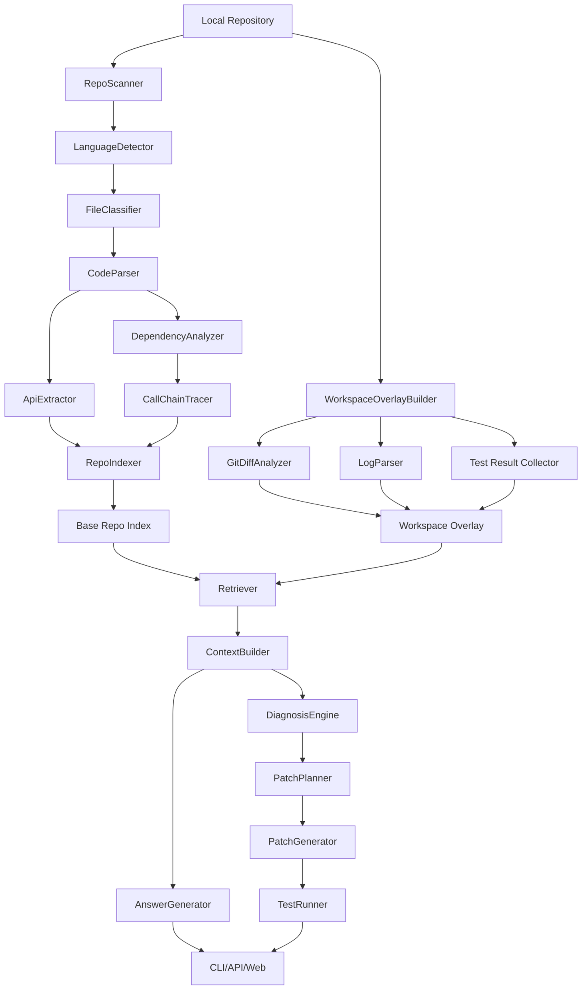
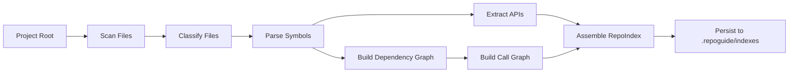
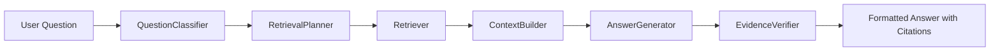
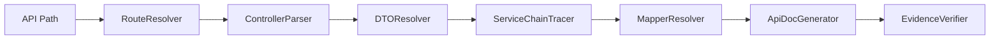
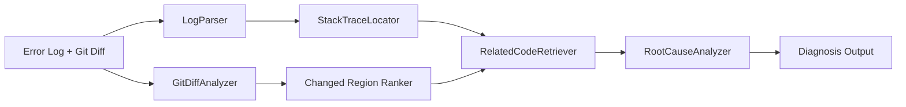
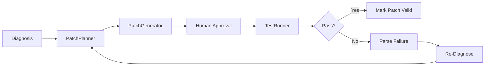

# 03_architecture.md

### 文档目的

定义 RepoGuide 的总体架构、核心模块、分层职责、数据流与设计取舍，确保系统先成为可复用的本地工程能力，再扩展为服务与可视化产品。

### 分层架构

RepoGuide 建议采用以下五层到六层架构：

| 层级 | 角色 | 责任 |
|---|---|---|
| RepoGuide Core SDK | 核心能力层 | 扫描、解析、索引、检索、诊断、patch、测试、trace |
| RepoGuide CLI | 本地交互层 | 命令行入口，适配本地开发者工作流 |
| RepoGuide Agent Orchestrator | 任务编排层 | 面向复杂问题选择工作流、拼装上下文、做证据校验 |
| RepoGuide Local Runtime | 本地执行层 | 读文件、读 git、跑测试、解析日志、调用系统命令 |
| RepoGuide API Server | 服务包装层 | 将 Core SDK 能力以 API 暴露，便于后续 Web / 集成 |
| RepoGuide Web UI | 展示层 | 项目总览、调用链展示、patch 预览、trace 可视化 |

### 总体架构图

### 核心模块设计

| 模块 | 职责 | 是否 MVP 核心 |
|---|---|---|
| RepoScanner | 扫描仓库、收集文件元信息 | 是 |
| LanguageDetector | 判定语言与项目类型 | 是 |
| FileClassifier | 识别文件角色 | 是 |
| CodeParser | 抽取类、函数、注解、import、调用 | 是 |
| ApiExtractor | 抽取接口定义、路径、请求体、响应体 | 是 |
| DependencyAnalyzer | 构建依赖关系图 | 是 |
| CallChainTracer | 生成调用链与近似链路 | 是 |
| RepoIndexer | 构建 Base Repo Index | 是 |
| WorkspaceOverlayBuilder | 构建本地增量上下文 | v4 开始核心 |
| GitDiffAnalyzer | 分析 diff 与疑点区域 | v4 |
| LogParser | 解析日志、堆栈与错误类型 | v4 |
| Retriever | 统一检索入口 | 是 |
| ContextBuilder | 组装可控上下文 | 是 |
| AnswerGenerator | 生成可溯源答案 | v5 |
| DiagnosisEngine | 诊断引擎 | v4-v5 |
| PatchPlanner | 制定修复方案 | v7 |
| PatchGenerator | 生成 diff patch | v7 |
| TestRunner | 执行测试并结构化结果 | v7 |
| TraceRecorder | 记录过程与证据 | 是 |

### 数据流设计

#### 项目索引流程

#### 项目问答流程

#### 接口解释流程

#### 调用链追踪流程

#### 本地 diff 诊断流程

#### Patch 建议与测试流程

### 设计取舍

#### 为什么先做 Core + CLI，而不是先做 Web

原因不是“前端不重要”，而是核心价值不在展示，而在**可复用的本地工程能力**：

1. **问题发生在本地工作区。**  
   真正的 bug、未提交修改、错误日志、测试失败都发生在开发者本地。

2. **Web 会提前引入错误抽象。**  
   如果一开始先做 Web，容易把产品做成一个“在线问答壳子”，忽视本地 diff、日志、测试、路径与权限问题。

3. **CLI 更贴近实际场景。**  
   开发者希望在终端中完成 `index / ask / diagnose / test / patch` 的闭环。

4. **Core 能力必须先稳定。**  
   解析器、索引器、检索器、诊断器这些能力以后既服务 CLI，也服务 API、Web、IDE 插件。

### 架构设计结论

RepoGuide 的架构应该坚持“**本地优先、索引优先、证据优先、编排后置**”。先把仓库理解、结构化索引和增量诊断做好，再让 LLM 与 Agent 发挥放大作用。

---
