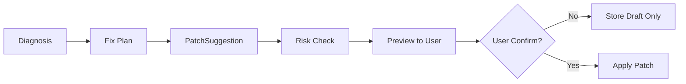

# 13_patch_and_test_design.md

### 文档目的

定义 patch 与测试能力的边界、流程和安全控制，确保 RepoGuide 可以帮助修复，但不会越权自动破坏用户工作区。

### Patch 设计原则

1. Patch 不应默认自动应用。
2. 必须先生成 `PatchSuggestion`。
3. 用户确认后才能 apply。
4. 每个 patch 都必须带解释、风险等级与回滚方案。
5. patch 是“最小修改建议”，而不是大规模重构。

### PatchSuggestion 必需字段

- 修改文件
- diff
- 修改原因
- 风险等级
- 回滚方案
- 建议测试命令

### Patch 风险等级建议

| 风险等级 | 特征 |
|---|---|
| Low | 单文件、小范围、无公共接口变化 |
| Medium | 影响多个方法或配置，但范围可控 |
| High | 影响多文件、公共接口、数据结构 |
| Critical | 涉及敏感配置、大量删除、不可逆迁移 |

### Patch 生成流程



### apply-patch 的行为要求

- 默认先预览，不执行写入。
- 加 `--confirm` 才可应用。
- 应用前自动保存备份或记录 reverse patch。
- 应用后立即建议运行测试。
- Trace 记录 patch 来源、应用结果与文件变更摘要。

### TestRunner 设计要求

#### 支持命令

- `pytest`
- `mvn test`
- `npm test`

#### 必需能力

| 能力 | 说明 |
|---|---|
| 超时控制 | 防止测试卡死 |
| 输出截断 | 避免海量日志挤爆上下文 |
| 错误日志保存 | 便于二次诊断 |
| 测试结果结构化 | 便于回传 DiagnosisEngine |
| 失败后闭环 | 自动进入再次诊断流程 |

### 失败闭环

```text
Patch → Run Test → Fail → Parse Failure → Diagnose Again → Suggest New Patch
```

这条闭环是 RepoGuide 从“会解释”走向“帮助修复”的关键。

### 测试结果结构建议

- `status`
- `command`
- `duration_ms`
- `exit_code`
- `passed_count`
- `failed_count`
- `skipped_count`
- `failure_summaries`
- `raw_log_path`

### 安全边界

RepoGuide 必须明确禁止：

- 自动删除大量文件。
- 修改隐藏配置文件中的敏感信息。
- 无确认执行 destructive 命令。
- 执行下载脚本、删除脚本、系统级写操作。
- 在未授权情况下访问仓库外目录。

### 设计结论

Patch 和测试能力的价值，不在于“自动改代码”，而在于**把修复建议工程化、受控化、可验证化**。这也是 RepoGuide 与普通聊天修 bug 的根本区别。

---
